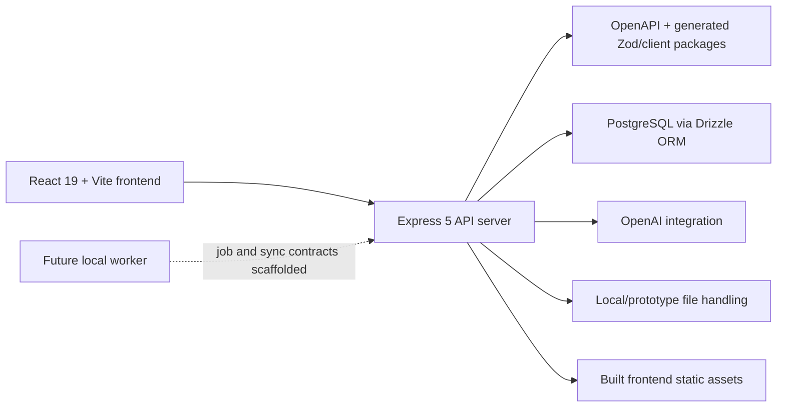
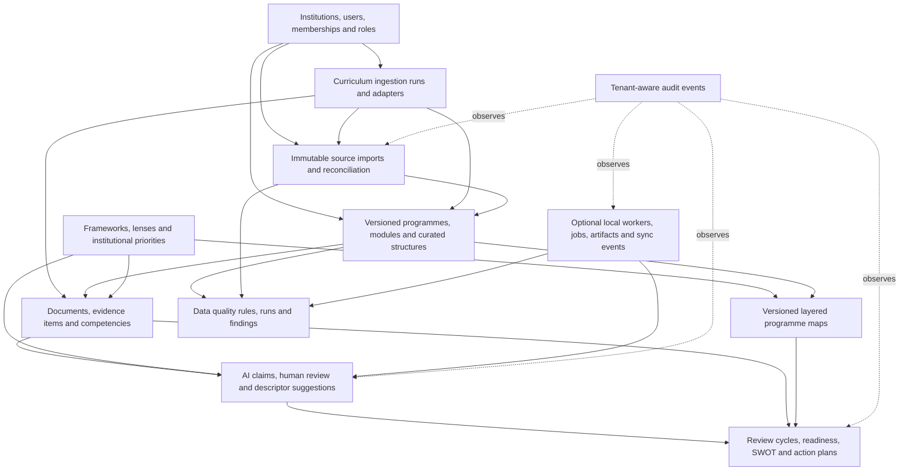

# CAST v3 Architecture

## Purpose

CAST stands for Curriculum Analysis, Strategy and Transformation.

CAST v3 is evolving from a Replit prototype into a multi-institution curriculum intelligence and evidence platform for higher education. The platform is intended to support programme review, validation, revalidation, accreditation, curriculum enhancement, readiness assessment, SWOT analysis and action planning.

The current repository contains two architectural generations:

- The working prototype application and its legacy workflow tables.
- The additive CAST v3 domain foundation introduced during Phase 2.

Phase 2 deliberately does not migrate user-facing workflows. The new model sits beside the prototype so product migration can happen incrementally.

Fresh CAST v3 deployments do not require the prototype legacy tables. Legacy compatibility views are optional and are only used in environments migrating data from the original prototype schema.

## Architectural Principles

- Evidence first: analysis and decisions must remain traceable to source evidence.
- Programme led: programme versions and curated structures are the main analytical context.
- Source preservation: imported data remains immutable and poor source data is made visible.
- Human authority: AI outputs are claims and observations, not institutional truth.
- Versioned interpretation: frameworks, lenses, programme maps, priorities and descriptors are versioned.
- Layered analysis: multiple lenses may operate over one evidence base.
- Progression aware: competency expectations and observations use explicit scaffolding levels.
- Additive migration: legacy functionality remains available until workflows are safely migrated.
- Tenant boundaries: institution ownership is explicit throughout the new model.
- Hybrid processing: privacy-sensitive analysis may run through optional institution-local workers.

## Current Runtime Architecture



### Frontend

- Package: `artifacts/sar-review`
- Framework: React 19 and TypeScript
- Build tool: Vite 7
- UI: Tailwind CSS 4, Radix UI and Lucide icons
- Data access: TanStack Query and generated API clients
- Routing: Wouter

The current UI remains the prototype experience. Phase 2 introduced no UI redesign or workflow migration.

### Backend

- Package: `artifacts/api-server`
- Runtime: Node.js 24
- Framework: Express 5
- Build: esbuild bundle
- Logging: Pino
- Sessions: Express session middleware backed by PostgreSQL `app_sessions`
- Document support: PDF and spreadsheet parsing

The production API bundle serves both API routes and the built frontend.

Phase 3B-2 introduces reusable tenant-aware API middleware for session, user, institution, programme and review access resolution. Phase 3B-3 adds request IDs and API-side audit writing conventions for security events. These foundations are not yet applied broadly to legacy prototype routes.

### API Contracts

- OpenAPI source: `lib/api-spec/openapi.yaml`
- Generated runtime validation: `lib/api-zod`
- Generated React client: `lib/api-client-react`

Phase 1 retained prototype API compatibility while making generated clients and route types portable outside Replit.

### Database

- Package: `lib/db`
- Database: PostgreSQL
- ORM: Drizzle ORM
- Migration location: `lib/db/migrations`
- Schema exports: `lib/db/src/schema/index.ts`

The core CAST v3 migration chain creates the Phase 2 domain model plus Phase 3B-1 identity/session foundations across tenant access, imports, curated curriculum, evidence, analysis, review, data quality, local-worker, session and programme-team contexts. Prototype legacy tables are not required for fresh production databases. Optional legacy compatibility views are kept in a separate migration for prototype migration environments only.

## CAST v3 Domain Architecture



## Bounded Contexts

### Tenant and Access

Institutions define tenant boundaries. Users join institutions through memberships, and roles attach to memberships. Current schema ownership is explicit, but database row-level security has not yet been implemented.

### Frameworks, Lenses and Priorities

Frameworks describe competency structures such as GreenComp, DigComp and EntreComp. Lenses define how evidence should be selected, interpreted and returned. Institutional priorities provide locally owned strategic expectations alongside external frameworks.

Frameworks and lenses are deliberately separate: one framework may be interpreted through multiple lenses, and one lens may bind multiple framework versions.

### Source Imports and Curated Curriculum

Source-system data, including future Akari imports, is retained in immutable source records and typed source entities. Reconciliation links connect source data to CAST records without overwriting the source.

Curated programme versions, module descriptors and structures are editable CAST representations. They support stages, semesters, pathways, module groups, core/option status, ordering and credits while tolerating incomplete data.

Phase 4A introduces a curriculum ingestion layer above source imports and curated curriculum. Akari-compatible CSV/XLSX, single descriptor PDF/text uploads, manual module entry and the future programme wizard create ingestion runs, items, errors and record links. Pathway-specific adapters may create source records where applicable, but all pathways ultimately materialise the same canonical documents, modules, module descriptors, descriptor sections and evidence items. Downstream analysis consumes those canonical records rather than pathway-specific import tables.

### Evidence and Competency

Documents, document versions and exact sections form evidence sources alongside descriptor sections, learning outcomes and assessment components. Evidence items retain precise provenance where possible.

Competencies belong to framework versions. Programme-owned graduate attributes and programme expectations are first-class. Expected and observed scaffolding use:

- Not Applicable
- Introduce
- Develop
- Integrate
- Demonstrate

### AI Claims and Human Review

Analysis runs and model runs preserve prompt, model and execution metadata. AI outputs are stored as claims linked to evidence. Human reviews may accept, reject, amend, request clarification or mark claims and suggestions not applicable.

Descriptor improvement suggestions remain separate from official descriptors and cannot automatically overwrite source or curated descriptor text.

### Programme Maps

Programme maps are first-class, versioned objects. Each map may contain multiple layers sourced from frameworks, lenses, institutional priorities, readiness results, data quality or custom analysis. Cells and annotations preserve review state and evidence summaries.

### Review, Readiness, SWOT and Action Planning

Generic review cycles support programme review, validation, revalidation, accreditation, DELTA readiness and institutional-priority review. Readiness findings are evidence-informed observations, not automatic award or application decisions.

SWOT items retain links to evidence, AI claims, human reviews, programme maps, competencies and priorities. Action items connect to SWOT and readiness findings and support owners, partners, milestones, indicators and approval.

### Data Quality

Data-quality rules produce findings without silently correcting source records. Findings can reference source records, imported structures, curated structures, modules, descriptors, evidence, review cycles and competencies.

Quality links use restrictive foreign keys so provenance cannot disappear through accidental record deletion.

### Local Workers

Local-worker scaffolding supports optional institution-local document extraction, embeddings, AI classification, batch analysis and data-quality execution.

Jobs capture privacy mode, provenance, status, attempts and timestamps. Artifacts store locators, checksums, sensitivity and encryption metadata so documents do not have to be processed or stored in the cloud.

## Deployment Architecture

The repository can run outside Replit using standard Node.js and PNPM. It includes:

- Environment examples for root, frontend and API packages.
- A Render Blueprint with managed PostgreSQL.
- A multi-stage Dockerfile.
- A portable PNPM enforcement script.
- Conditional Replit Vite plugins retained only for prototype compatibility.

Current production-start command:

```bash
PORT=3000 NODE_ENV=production node --enable-source-maps artifacts/api-server/dist/index.mjs
```

Before commercial production, replace Render `push-force` and single-admin authentication with controlled migrations, tenant-aware identity/RBAC, API authorization middleware and RLS hardening.

## Current Architectural Status

Phase 1 and Phase 2 provide a production-portable runtime foundation and an additive future domain model. They do not yet provide migrated CAST v3 product workflows.

The next architectural milestone is to validate all seven migrations against disposable PostgreSQL, establish production migration automation and tenant-security enforcement, then migrate one end-to-end programme-led workflow onto the new model.
